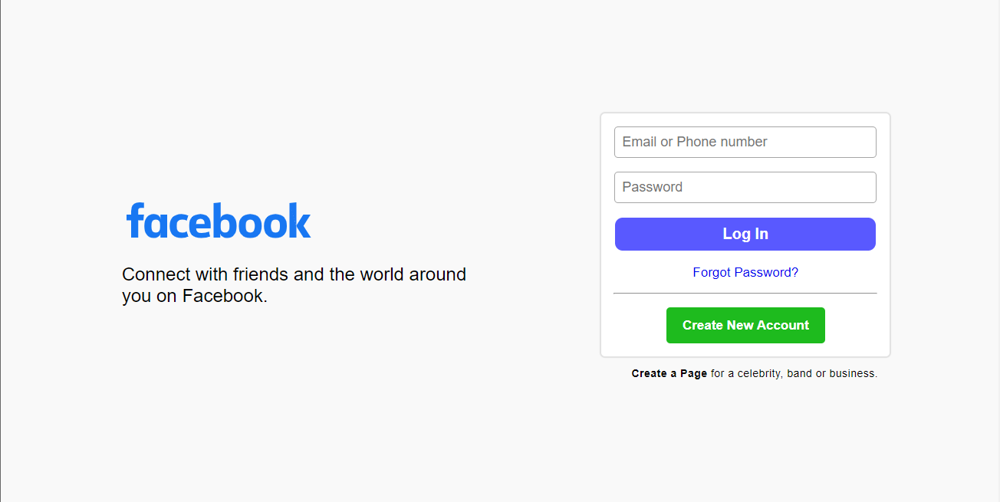
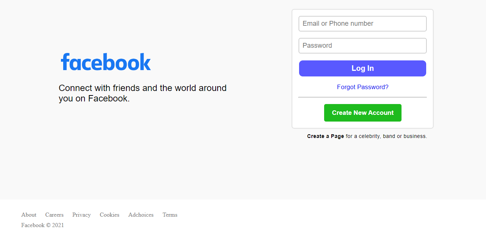

# Facebook loginpage clone
Clone of login interface of Facebook login page

## Table of contents

- [Overview](#overview)
  - [The challenge](#the-challenge)
  - [Screenshots](#screenshots)
  - [Links](#links)
- [My process](#my-process)
  - [Built with](#built-with)
  - [What I learned](#what-i-learned)
- [Author](#author)

## Overview

### The challenge

Clone the login interface of Facebook login page

### Screenshots

### Links

- [Solution URL](https://github.com/dipshanadhikari/facebook-loginpage-clone/blob/main/index.html)
- [Live Site URL](https://dipshanadhikari.xyz/projects/facebook-loginpage-clone)

## My process

### Built with

- Semantic HTML5 markup
- CSS custom properties
- Flexbox
- Media queries

### What I learned

I learned to turn my ideas into reality. I gained some experience in making designs. I just knew how much do I know.

## Author

- Website - [Dipshan Adhikari](https://www.dipshanadhikari.xyz)
- Facebook - [Dipshan Adhikari](https://www.facebook.com/dipshan.adhikari.1234)
